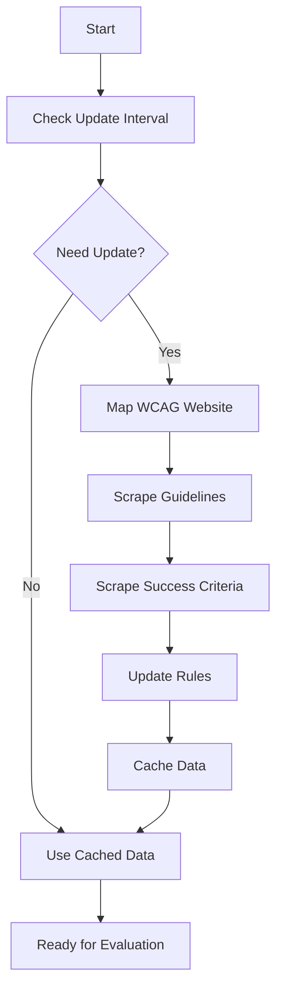
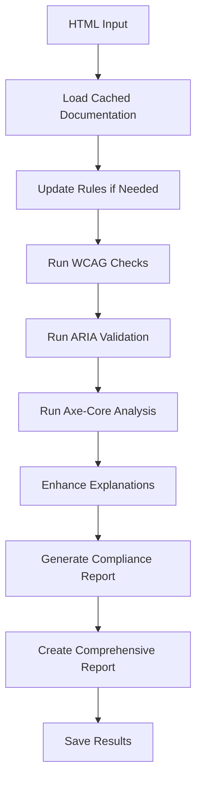

# 🌉 Accessibility Integration Guide

**Complete integration between accessibility-scraper and mcp-accessibility-evaluator for comprehensive accessibility analysis**

## 🎯 Overview

This integration bridge combines the power of both components to create a comprehensive accessibility analysis system:

- **accessibility-scraper**: Fetches live WCAG documentation and maps website structures
- **mcp-accessibility-evaluator**: Evaluates HTML content against accessibility standards
- **Integration Bridge**: Seamlessly connects both components for enhanced analysis

## ✨ Integration Features

### 🔄 Live Documentation Updates
- Automatically fetches latest WCAG guidelines from W3C
- Updates accessibility rules based on fresh documentation
- Caches documentation for offline use
- Configurable update intervals

### 🧠 Enhanced Evaluation
- Uses live WCAG data for more accurate evaluations
- Dynamic rule generation based on scraped content
- Comprehensive analysis including compliance scoring
- Educational explanations with fresh examples

### 🛠️ Unified Configuration
- Single configuration system for both components
- Environment variable support
- Configurable update intervals and caching
- Centralized logging and error handling

### 📊 Comprehensive Analysis Pipeline
- Scrape → Evaluate → Report workflow
- Detailed compliance reports with recommendations
- ARIA validation with best practices
- Integration with AI assistants via MCP

## 🚀 Quick Start

### 1. Initialize Integration

```bash
# Navigate to the integration bridge
cd integration-bridge

# Install dependencies
npm install

# Build the project
npm run build

# Check integration status
npm run integration status
```

### 2. Update WCAG Documentation

```bash
# Fetch latest WCAG documentation
npm run integration update-docs

# This will:
# - Map WCAG website structure
# - Scrape guidelines and success criteria
# - Cache documentation for offline use
# - Update accessibility rules
```

### 3. Perform Comprehensive Analysis

```bash
# Analyze HTML content
npm run integration analyze --html '<html><body></body></html>'

# Analyze URL
npm run integration analyze --url https://example.com

# Analyze file
npm run integration analyze --file ./test.html
```

## 🔧 Configuration

### Environment Variables

Create a `.env` file in the project root:

```env
# Scraper Configuration
WCAG_BASE_URL=https://www.w3.org/WAI/WCAG21/
MAX_CONCURRENT_REQUESTS=5
REQUEST_DELAY_MS=1000
TIMEOUT_MS=30000
HEADLESS=true

# Evaluator Configuration
WCAG_LEVEL=AA
STRICT_MODE=false
MIN_IMPACT_LEVEL=moderate
ENABLE_AXE_CORE=true

# Integration Configuration
OUTPUT_DIR=./output
CACHE_DIR=./cache
UPDATE_INTERVAL=24
AUTO_UPDATE=true

# MCP Configuration
MCP_SERVER_NAME=accessibility-evaluator
ENABLE_ENHANCED_MODE=true

# Logging Configuration
LOG_LEVEL=info
ENABLE_FILE_LOGGING=true
LOG_FILE=./logs/accessibility-integration.log
```

### Configuration File

Create `accessibility-integration.config.json`:

```json
{
  "scraper": {
    "wcagBaseUrl": "https://www.w3.org/WAI/WCAG21/",
    "maxConcurrentRequests": 5,
    "requestDelayMs": 1000,
    "timeoutMs": 30000,
    "headless": true
  },
  "evaluator": {
    "wcagLevel": "AA",
    "strictMode": false,
    "includeCodeExamples": true,
    "minImpactLevel": "moderate",
    "enableAxeCore": true,
    "enableARIAValidation": true
  },
  "integration": {
    "outputDir": "./output",
    "cacheDir": "./cache",
    "updateInterval": 24,
    "autoUpdate": true,
    "enableCaching": true,
    "cacheExpiration": 168
  },
  "mcp": {
    "serverName": "accessibility-evaluator",
    "version": "1.0.0",
    "enableEnhancedMode": true,
    "enableDocumentationFetching": true,
    "enableComprehensiveAnalysis": true
  },
  "logging": {
    "level": "info",
    "enableFileLogging": true,
    "logFile": "./logs/accessibility-integration.log",
    "enableConsoleLogging": true
  }
}
```

## 📋 Available Commands

### Integration Bridge Commands

```bash
# Update WCAG documentation
npm run integration update-docs [options]

# Perform comprehensive analysis
npm run integration analyze [options]

# Check integration status
npm run integration status

# Show detailed help
npm run integration help-integration
```

### Individual Component Commands

```bash
# Accessibility Scraper
npm run scrape <url> [options]
npm run map <url> [options]
npm run extract [options]
npm run search <query> [options]

# MCP Accessibility Evaluator
# (Use with AI assistants like Claude Desktop, Cursor, etc.)
```

## 🔄 Integration Workflow

### 1. Documentation Update Cycle



### 2. Analysis Pipeline



## 🧪 Testing the Integration

### Test Documentation Update

```bash
# Test WCAG documentation fetching
npm run integration update-docs

# Check if data was cached
ls -la cache/
cat cache/wcag-data.json
```

### Test Comprehensive Analysis

```bash
# Create test HTML file
echo '<html><body><h3>Welcome</h3><form><input type="email" placeholder="Email"></form></body></html>' > test.html

# Analyze the file
npm run integration analyze --file test.html

# Check results
ls -la output/
cat output/accessibility-report-*.json
```

### Test MCP Integration

```bash
# Start MCP server with enhanced mode
cd mcp-accessibility-evaluator
npm run build
node dist/index.js

# In another terminal, test with MCP client
# (This requires an MCP-compatible AI assistant)
```

## 📊 Output Examples

### Documentation Update Output

```json
{
  "guidelines": [
    {
      "id": "1.1",
      "title": "Non-text Content"
    },
    {
      "id": "1.3",
      "title": "Adaptable"
    }
  ],
  "successCriteria": [
    {
      "id": "1.1.1",
      "title": "Non-text Content",
      "level": "A"
    },
    {
      "id": "1.4.3",
      "title": "Contrast (Minimum)",
      "level": "AA"
    }
  ],
  "lastUpdated": "2024-01-15T10:30:00.000Z"
}
```

### Comprehensive Analysis Output

```json
{
  "timestamp": "2024-01-15T10:30:00.000Z",
  "url": "test.html",
  "evaluation": {
    "issues": [
      {
        "type": "error",
        "rule": "WCAG 1.1.1",
        "message": "Images must have alternative text",
        "element": "",
        "selector": "img",
        "standard": "WCAG",
        "level": "A",
        "impact": "critical",
        "detailedExplanation": "Images and other non-text content must have alternative text...",
        "userImpact": "Users who are blind or have low vision rely on screen readers...",
        "howToFix": {
          "steps": ["Add an alt attribute to every img element"],
          "badExample": "",
          "goodExample": ""
        }
      }
    ],
    "summary": {
      "totalIssues": 3,
      "errors": 2,
      "warnings": 1,
      "info": 0
    }
  },
  "compliance": {
    "level": "A",
    "overallScore": 65,
    "meetsTarget": false,
    "targetLevel": "AA"
  },
  "aria": {
    "issues": [],
    "validUsages": [],
    "statistics": {
      "totalARIAElements": 0
    }
  },
  "summary": {
    "totalIssues": 3,
    "complianceLevel": "A",
    "meetsAA": false,
    "ariaIssues": 0,
    "lastUpdate": "2024-01-15T10:30:00.000Z"
  }
}
```

## 🔧 Advanced Configuration

### Custom WCAG Rules

The integration allows you to add custom accessibility rules:

```typescript
// In enhanced-evaluator.ts
private checkGuidelineCompliance($: cheerio.CheerioAPI, guideline: { id: string; title: string }): AccessibilityIssue[] {
  const issues: AccessibilityIssue[] = [];
  
  // Add your custom rule logic here
  if (guideline.id === "1.1") {
    // Custom implementation for Non-text Content
  }
  
  return issues;
}
```

### Custom Update Intervals

```json
{
  "integration": {
    "updateInterval": 12,  // Update every 12 hours
    "autoUpdate": true,
    "cacheExpiration": 72  // Cache expires after 72 hours
  }
}
```

### Custom Output Formats

```typescript
// Custom report formatter
class CustomReportFormatter {
  static formatReport(report: any): string {
    // Your custom formatting logic
    return `Custom Report: ${report.summary.totalIssues} issues found`;
  }
}
```

## 🚨 Troubleshooting

### Common Issues

1. **Documentation Update Fails**
   ```bash
   # Check network connectivity
   curl -I https://www.w3.org/WAI/WCAG21/
   
   # Check cache directory permissions
   ls -la cache/
   ```

2. **Analysis Fails**
   ```bash
   # Check if both components are built
   ls -la accessibility-scraper/dist/
   ls -la mcp-accessibility-evaluator/dist/
   
   # Check configuration
   npm run integration status
   ```

3. **MCP Server Issues**
   ```bash
   # Test MCP server directly
   cd mcp-accessibility-evaluator
   node dist/index.js
   
   # Check MCP configuration
   cat ~/.config/claude-desktop/config.json
   ```

### Debug Mode

Enable debug logging:

```env
LOG_LEVEL=debug
ENABLE_FILE_LOGGING=true
```

### Reset Configuration

```bash
# Reset to defaults
npm run integration reset-config

# Or manually delete config files
rm accessibility-integration.config.json
rm .env
```

## 🔄 Maintenance

### Regular Updates

```bash
# Update documentation weekly
npm run integration update-docs

# Check for component updates
git submodule update --remote

# Rebuild components
npm run build:mcp
npm run build:scraper
```

### Cache Management

```bash
# Clear cache
rm -rf cache/

# Check cache size
du -sh cache/

# Clean old reports
find output/ -name "*.json" -mtime +30 -delete
```

## 📚 API Reference

### Integration Bridge API

```typescript
class AccessibilityIntegrationBridge {
  async initialize(): Promise<void>
  async updateWCAGDocumentation(): Promise<ScrapedWCAGData>
  async analyzeAccessibility(html: string, url?: string): Promise<any>
  async cleanup(): Promise<void>
}
```

### Enhanced Evaluator API

```typescript
class EnhancedAccessibilityEvaluator {
  async initialize(): Promise<void>
  async evaluateHTMLEnhanced(html: string): Promise<EvaluationResult>
  async getComprehensiveAnalysis(html: string): Promise<any>
  async checkForUpdates(): Promise<void>
}
```

### Configuration Manager API

```typescript
class ConfigManager {
  getConfig(): IntegrationConfig
  async updateConfig(updates: Partial<IntegrationConfig>): Promise<void>
  validateConfig(): { isValid: boolean; errors: string[] }
  async createExampleFiles(): Promise<void>
  async resetToDefaults(): Promise<void>
}
```

## 🤝 Contributing

### Development Setup

```bash
# Clone with submodules
git clone --recurse-submodules https://github.com/your-org/github-accessibility-service.git

# Install dependencies for all components
npm install
cd accessibility-scraper && npm install
cd ../mcp-accessibility-evaluator && npm install
cd ../integration-bridge && npm install

# Build all components
npm run build:all
```

### Testing

```bash
# Run integration tests
npm run test:integration

# Run component tests
npm run test:scraper
npm run test:mcp

# Run comprehensive tests
npm run test:all
```

### Adding New Features

1. **New WCAG Rules**: Add to `enhanced-evaluator.ts`
2. **New Scraper Features**: Extend `PuppeteerScrapingService`
3. **New MCP Tools**: Add to `index.ts` in mcp-accessibility-evaluator
4. **New Integration Features**: Extend `AccessibilityIntegrationBridge`

## 📄 License

This integration is part of the GitHub Accessibility Service project and is licensed under the MIT License.

## 🌟 Acknowledgments

- **W3C Web Accessibility Initiative** for WCAG guidelines
- **axe-core team** for accessibility testing engine
- **MCP Protocol** for AI assistant integration
- **Puppeteer team** for web scraping capabilities

---

**Building a more accessible web through integrated analysis and education.** 🌟
